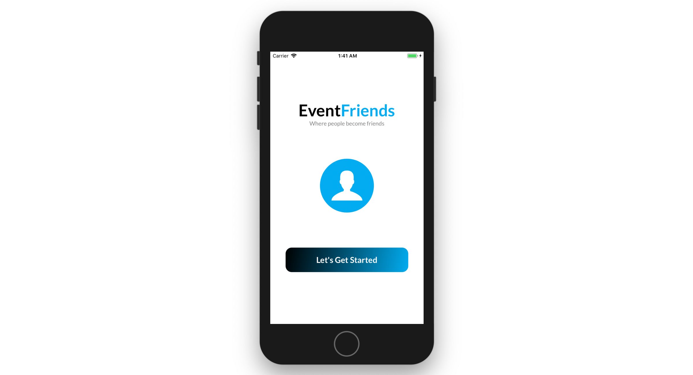
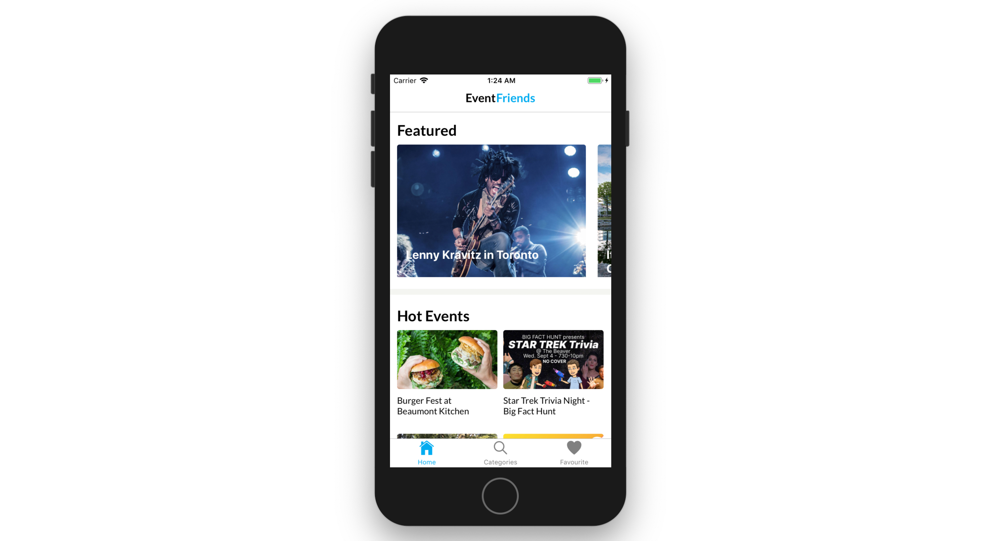
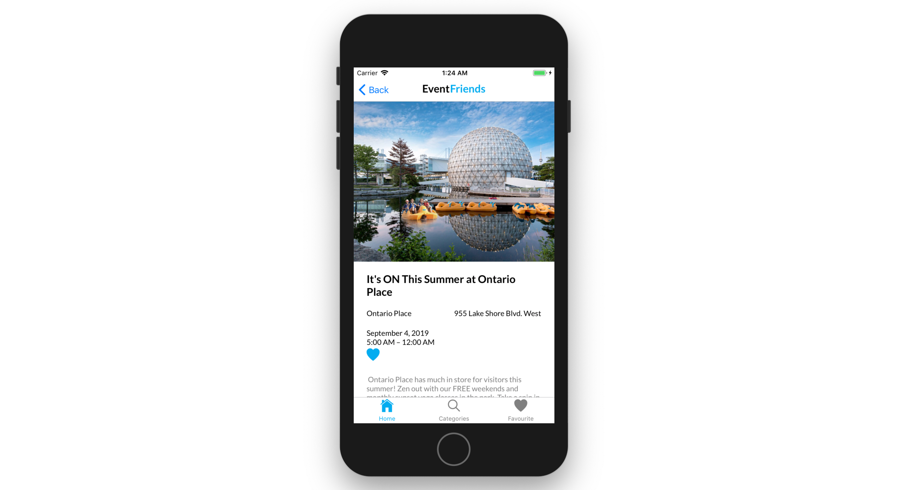
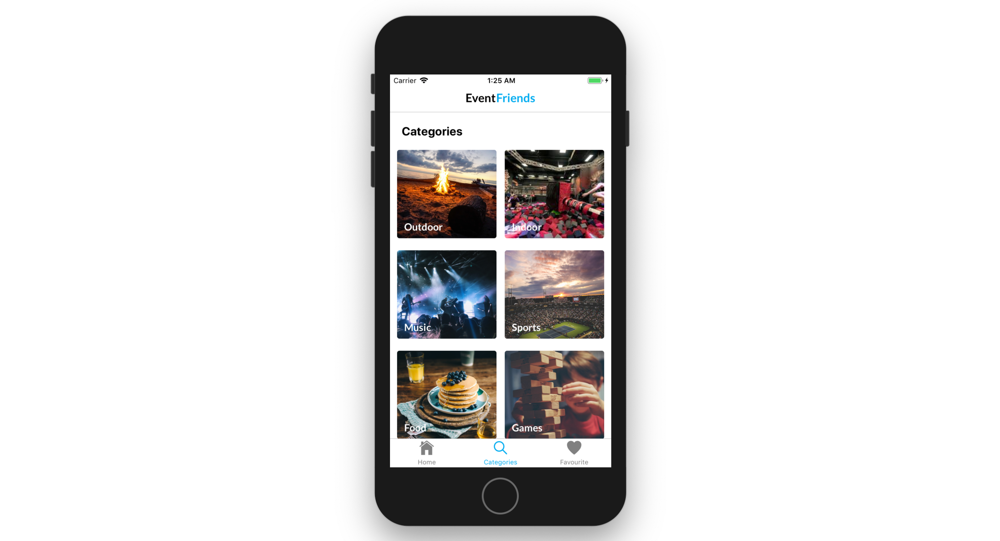
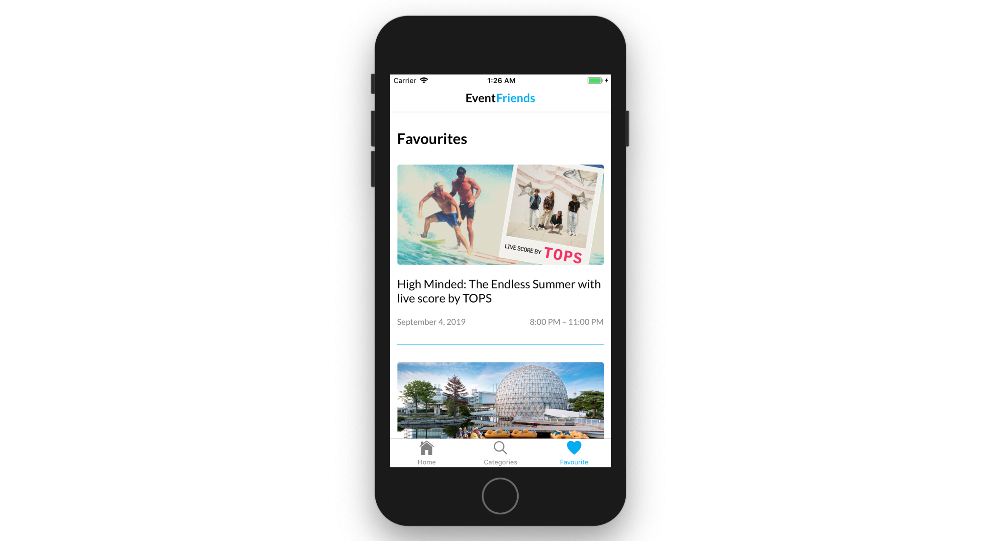

# EventFriends

## Introduction

**EventFriends** is a React Native app that helps users find events in local areas. Unlike other event apps that show ticketed events, this app is meant for more casual events that do not require tickets.

## Screenshots

Landing Page

Main Event Page

Event Detail Page

Categories Page

Favourites Page

## Technologies

- [React Native](https://facebook.github.io/react-native/)
- [SCSS](https://sass-lang.com/)
- [Javascript](https://www.javascript.com/)

## Features

- Find local events in the Events Page that shows the featured events at the moment in horizontal scroll view style and other hot events.
- Press on an event you are interested in which takes you to another page that shows specific details about that event with a map at the bottom that shows you where that event is located.
- Press on the heart on an event and it will save in your Favourites page and you can easily access the events you were interested in.
- Search all events by categories in the Categories page which breaks each event down into different categories you want.

## Status

This app was built in one week as my capstone project during my time as a student in the BrainStation full time Web Development Program. At the time I did not know how to build in React Native so I had to look at all the documents and learn off of youtube and on the fly as I was building this app. I tried to make it look very clean and very user friendly as well as solve the problem of not knowing what to do when people want to go out.

### Ideas for Future Enhancements:

- I wanted to add a feature where you can login through 0Auth.
- With this login I wanted users to be able to create events and also join events that others have made. A great way to make new friends or make an easy way to organize making events with friends.
- I would also want to make it so that it would identify where in the world you are using this app and according to that show you the events in that area specifically. 

## Inspiration

My inspiration for this app was to create a React Native app. I wanted to step outside my comfort zone and learn a new framework and more than that learn how to build for native apps.

## Contact

Created by [Roy Lee](https://www.linkedin.com/in/roy-lee-jr/)
